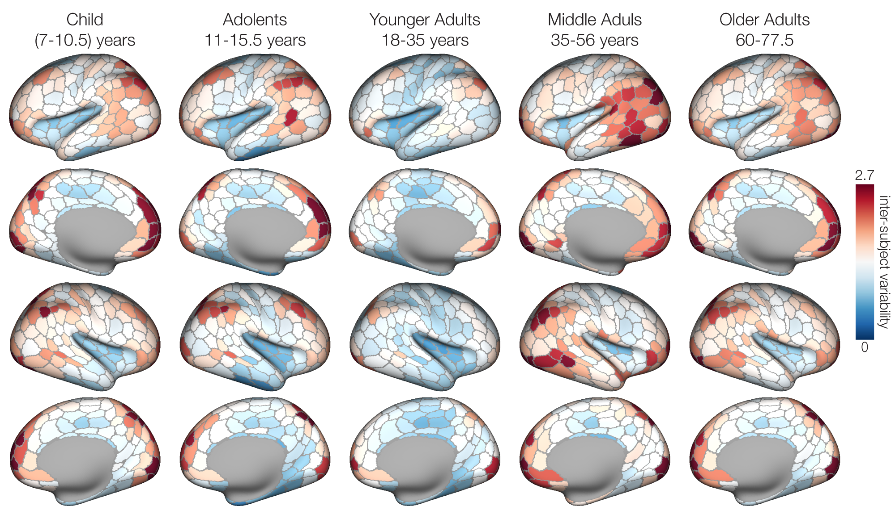

# neurocat

[](https://pdm-project.org)   

Neurocat is an fmri surface processing and visualization software by ailurophil.

# Installation

```shell
git clone https://github.com/yusaiwen/neurocat.git
```

Change directory to `dist` directory and install with pip:

```shell
pip install neurocat-0.1.0-py3-none-any.whl
```


# visulization

Visualization is on S1200's very inflated mesh. Visualization is encapsulated in neurocat.plotting.ds(). As a result you can get the figures like:



# Surface processing

Nibabel takes little effort to cope with GIFTI and CIFTI data. So Neurocat makes it easier for researchers to face up to surface file.

`neurocat.io.save_gii()` can save GIFTI file with header information. `neurocat.io.savecii()` can save the data to GIFTI file with header information.

Besides, `neurocat.util` provodes useful tools. `f59k264k()` converts 59k's no medial wall vertex data to vertex data with medial wall. On the contary, `f64k259k()` converts 64k to 59k. `atlas_2_wholebrain()` converts the data for a atlas(like, 360-length value for Glasser 2016) t0 64k, that can be overlayed directly on GIFTI mesh(or you can save then to GIFTI file.

