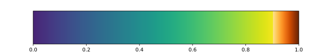
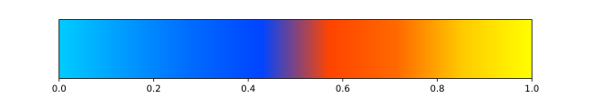

.. _usage_color:

Color Map manipulation
======================

When it comes to the visualization the brain map, it is wise to attach an appropriate color map.
The choice of the color map depends on the type of the data and the message to convey to the readers.

Pre-defined Color Maps
----------------------

For example, the gradient color map was designed to highlight the **very high** and **very low** values, which corresponds to the information by functional gradient.

.. code-block:: python

    >>> from neurocat import color
    >>> color.cmap.gradient()

Besides, `neurocat` made some commonly used color map that don't exit in matplotlib.
They were all stored in ``neurocat.color.cmap``.

Myeline map:

.. code-block:: python

    >>> color.cmap.myelin()

.. image:: ./_images/myeline.svg
   :align: center

``psych_no_none``(from connectome workbench):

.. code-block:: python

    >>> color.cmap.psych_no_none()

Hot map but without black

.. code-block:: python

    >>> color.cmap.hot_no_black()

.. image:: ./_images/hot_no_black.svg
   :align: center